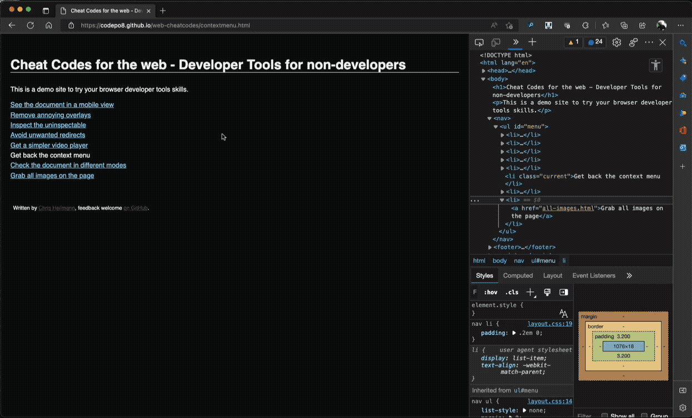

# Get back the context menu

The context menu of a browser is full of great functionality. You can open links in new tabs, save content, add to Collections, take screenshots, select content for translation, switch to immersive reader mode or tell the browser to read out the current page to you.

It is also the thorn in the side of people who think protecting their content from saving or copying is more important than allowing people to customise web products to their needs. A hamfisted way to to that is to define something called an [Event Handler](https://developer.mozilla.org/docs/Learn/JavaScript/Building_blocks/Events) on the document and override the context menu functionality.

You can try this [in this demo page](https://codepo8.github.io/web-cheatcodes/demos/contextmenu.html). When you right-click anywhere in the document, it'll tell you that it is copyrighted and you shouldn't do that.

To remove event handlers and get back the context menu you need to:

1. Go to the [Elements](https://docs.microsoft.com/en-us/microsoft-edge/devtools-guide-chromium/elements-tool/elements-tool) tool and select a high level element (`<html>` for example)
    
1. Pick `Event Listeners` in the lower panel and look for `contextmenu`
    
1. Click the triangle to expand the information
1. Hit the remove button

Here you can see this in action:

* [Back to list of all cheat codes](README.md)
