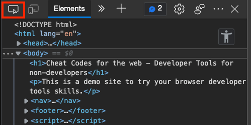
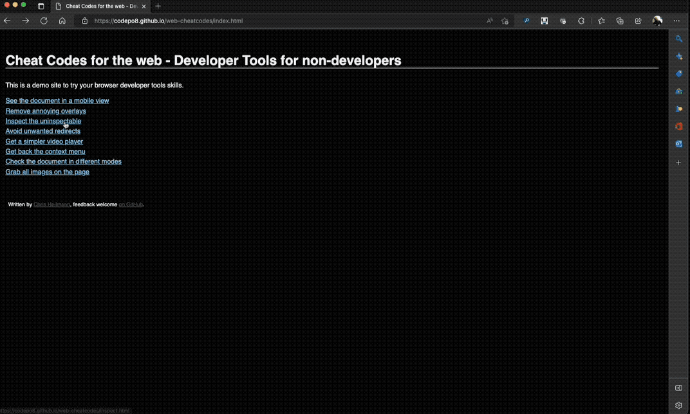

# Inspect the uninspectable

Web site maintainers are aware of the power of developer tools and try to block functionality. That's why some web sites will redirect you when you try to right-click and inspect them.

You can try this in the [example page to block inspection](https://codepo8.github.io/web-cheatcodes/demos/inspect.html). When you right-click this one, it redirects you to [example.com](https://example.com).

That's why it is always a safer bet to first [open the Developer tools](https://docs.microsoft.com/microsoft-edge/devtools-guide-chromium/overview#open-devtools) by pressing F12 and pick what you want to change using [the Inspect Tool](https://docs.microsoft.com/microsoft-edge/devtools-guide-chromium/css/inspect) instead by clicking the pointer icon.

The following recording shows that you can inspect the document even when the context menu is blocked by using the Inspect tool.

However, some websites may be clever enough to use an event listener
to prevent the use of key combinations, such as those used to open DevTools.
As shown in [remove-redirects](remove-redirects), you could disable
the event handler, but you still need DevTools open to do that.
Luckily, there's a foolproof method:

- In the browser toolbar (where your bookmarks and extensions are),
  click on the three dots (or three lines, depending on the browser)
- Click on `More Tools`
- Click on `Developer Tools`, alternatively known as `Web Developer Tools`

Just like that, you've opened DevTools- and there's nothing the website
can do to stop you from doing that.

- [Back to list of all cheat codes](README.md)
