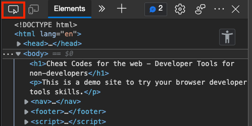
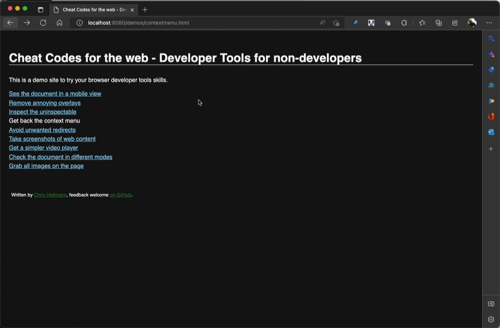
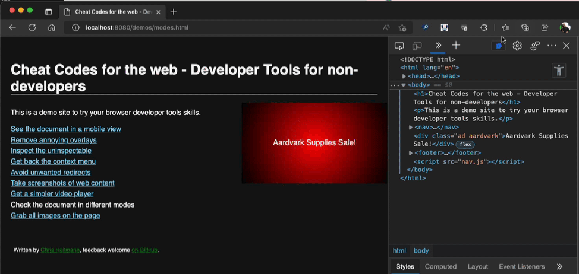

# Remove annoying overlays and page elements

Overlays are messages that cover the whole content when you get to a web site. Some are legally necessary (like cookie consent messages) but most are there to tell you that things aren't free and you should subscribe to get to the content. Some overlays are especially annoying as they show up with a few seconds delay or when you started to interact with the document.

Here's how to get rid of overlays using the browser developer tools. You can try it out yourself on the [example page with overlay](https://codepo8.github.io/web-cheatcodes/demos/overlay.html).

1. [Open Developer Tools](https://docs.microsoft.com/microsoft-edge/devtools-guide-chromium/overview#open-devtools) by pressing F12.
1. Use the [Inspect Tool](https://docs.microsoft.com/microsoft-edge/devtools-guide-chromium/css/inspect) by clicking the pointer icon to pick an element of the page
    
1. Move your mouse around the document until the colour overlay shows that the element covers the whole page
1. Click your mouse and the element will get highlighted in the Elements tool.
1. Press `Delete` to remove it

You can see it in action in this recording:

This works with any element you don't want to have on the page, for example when you want to [create a screenshot](screenshots.md) and get rid of extra content. Or when you want to print a page but not the ads.

You can try this on the [different modes demo page](https://codepo8.github.io/web-cheatcodes/page-modes.html) as shown in the following recording:

* [Back to list of all cheat codes](README.md)