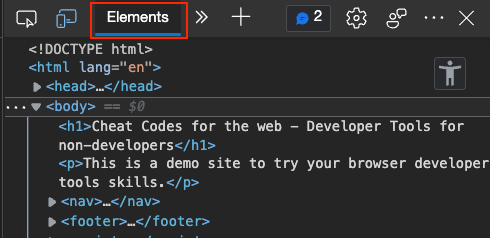
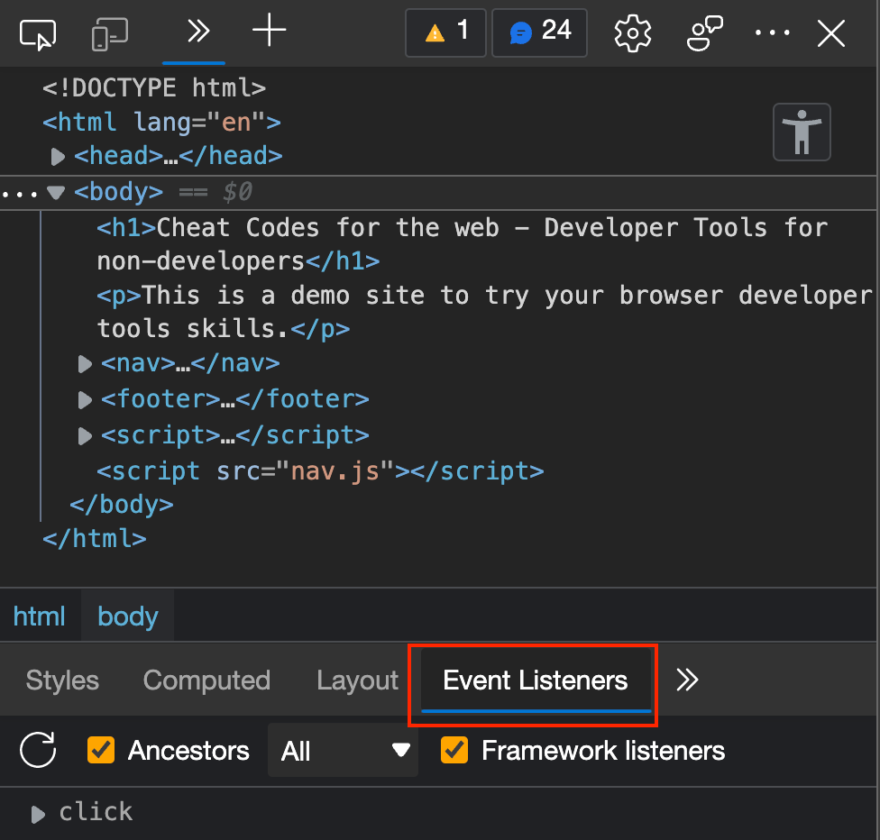
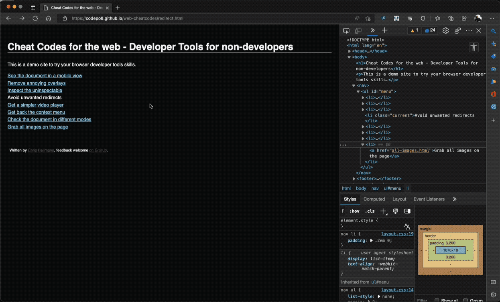

# Avoid unwanted redirects

Some - let's say fringe content - sites on the web annoy users by adding redirections when you click on them before you can interact with any of the real content. Basically clicking anywhere will cause a new page to pop up. Some use a transparent overlay for that [which you can remove using the Elements tool](overlays) but others are sneakier.

If you check the [unwanted redirect demo page](https://codepo8.github.io/web-cheatcodes/demos/redirect.html) using the Inspect tool you won't find an overlay.

What developers do to achieve this is to define something called an [Event Handler](https://developer.mozilla.org/docs/Learn/JavaScript/Building_blocks/Events) on the document make it react to any click on it.

To remove event handlers and not have annoying redirects you need to:

1. Go to the [Elements](https://docs.microsoft.com/en-us/microsoft-edge/devtools-guide-chromium/elements-tool/elements-tool) tool and select a high level element (for example `<html>`)
   
1. Pick `Event Listeners` in the lower panel and look for `click`
   
1. Click the triangle to expand the information
1. Hit the remove button

You can see this in action here:

Some of the more annoying web products also have `touch`, `keydown`, `keypress` and other events that react to user interaction you might have to remove.

- [Back to list of all cheat codes](README)
